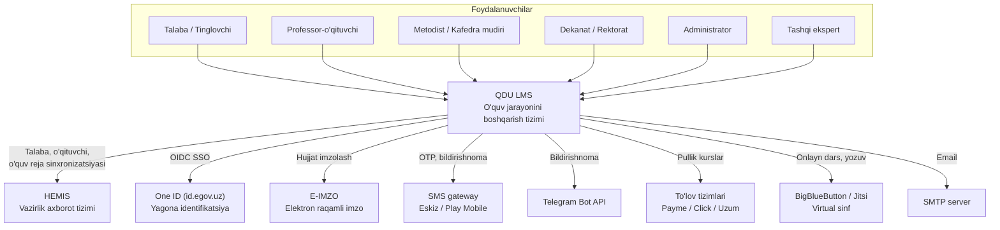
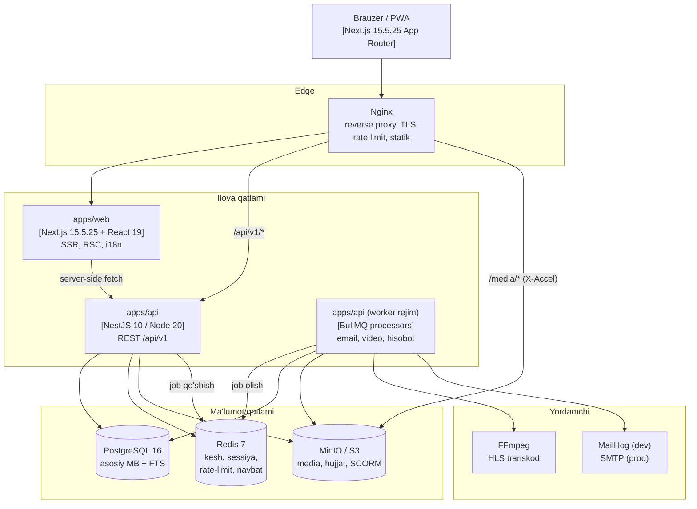
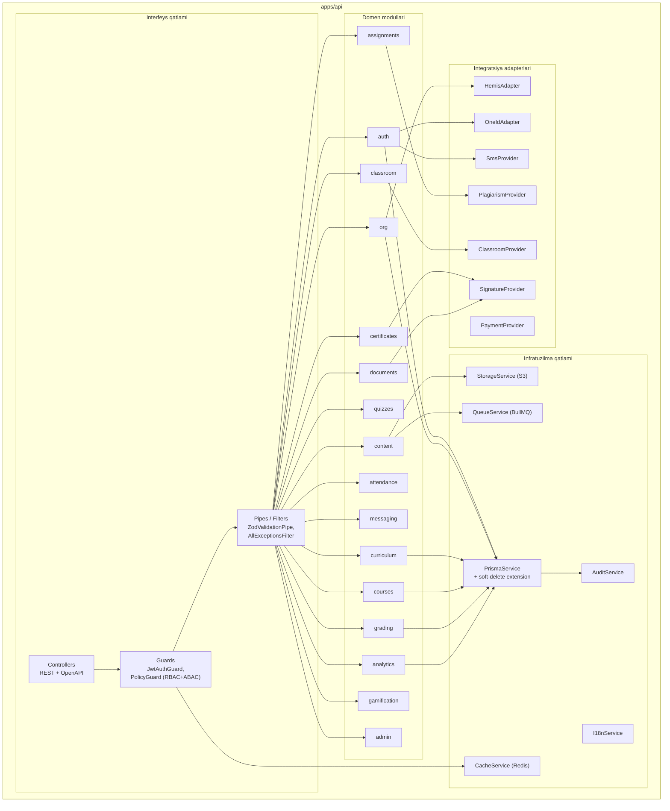
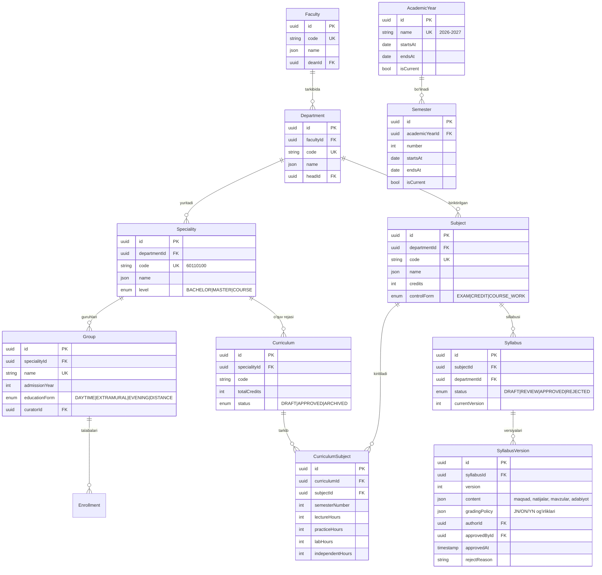
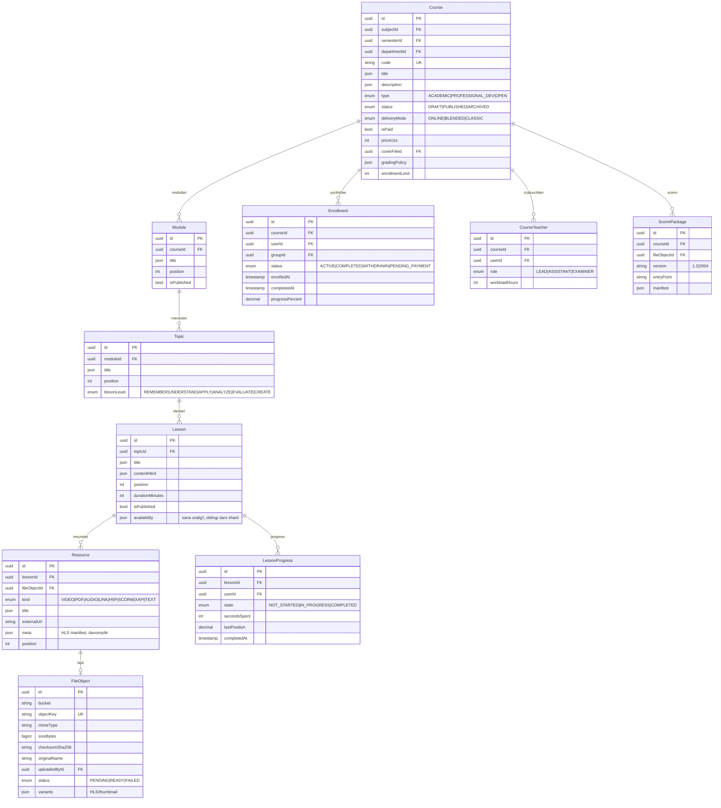
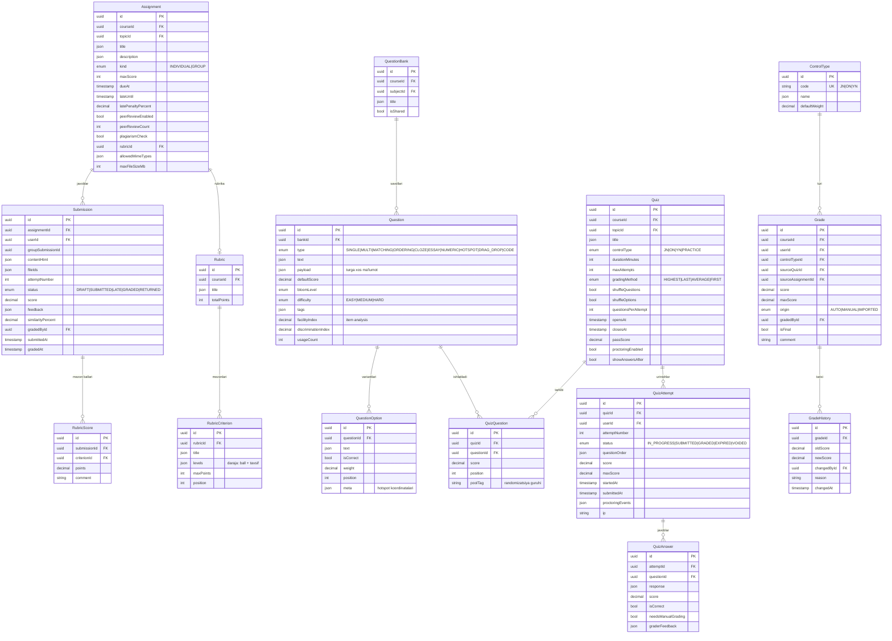
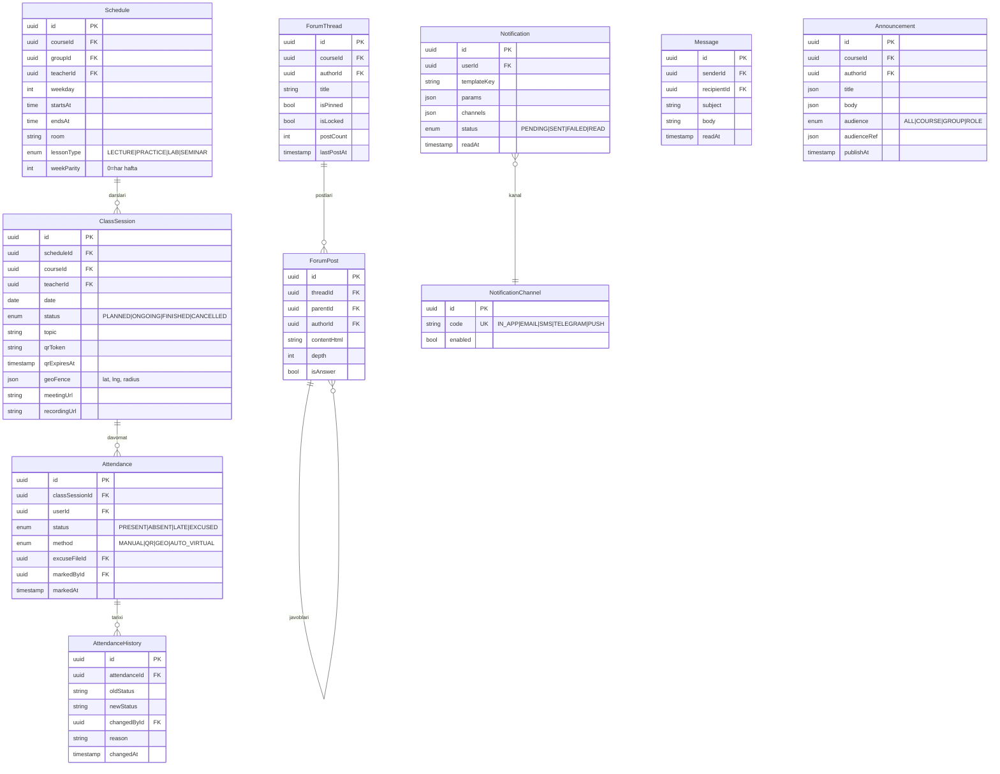
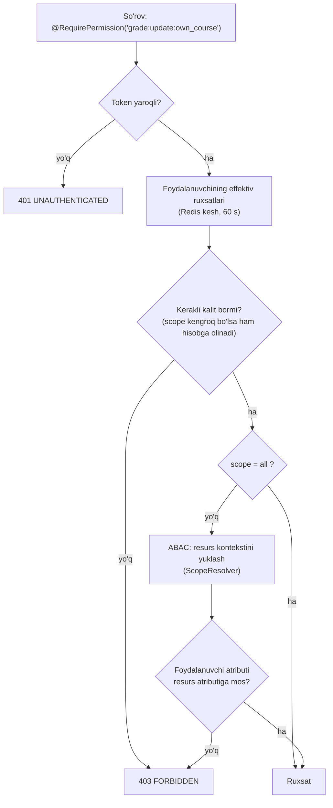
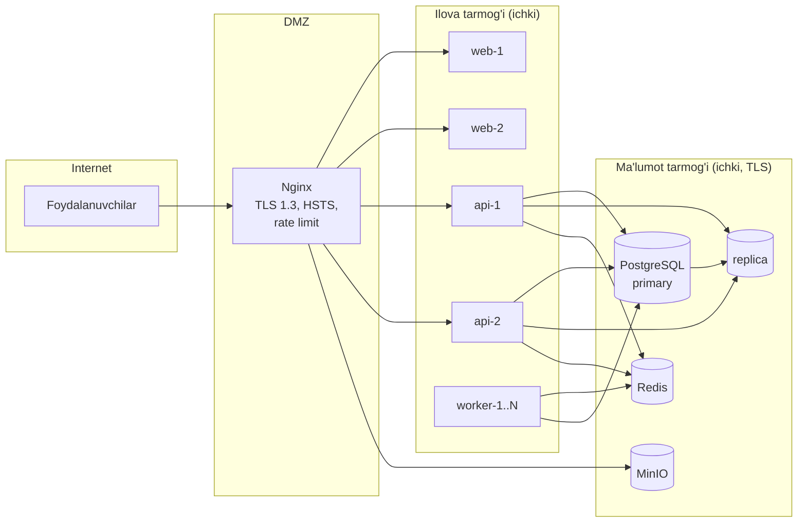

# B1 — Arxitektura: C4, ERD, ADR

**Loyiha:** QDU LMS
**Hujjat versiyasi:** 1.0
**Bog'liq hujjat:** [`00-analysis.md`](./00-analysis.md)

---

## 1. Arxitektura printsiplari

| #   | Printsip                 | Amaliy ma'nosi                                                                                                  |
| --- | ------------------------ | --------------------------------------------------------------------------------------------------------------- |
| P1  | **Modulli monolit**      | Bitta deploy birligi, ammo modullar orasida qat'iy chegara. Mikroservislarga bo'lish keyin ham mumkin (ADR-002) |
| P2  | **Stateless API**        | Sessiya holati Redis'da, ilova xotirasida emas → gorizontal masshtab (NF-08)                                    |
| P3  | **Deklarativ ruxsatlar** | Kodda `if (role === 'admin')` yo'q; faqat `@RequirePermission()` + policy engine                                |
| P4  | **Adapter chegarasi**    | Har bir tashqi tizim interfeys ortida; mock implementatsiya majburiy                                            |
| P5  | **Og'ir ish — navbatga** | 200 ms dan uzoq har qanday amal BullMQ ga                                                                       |
| P6  | **Ma'lumot yo'qolmaydi** | Soft delete + append-only tarix jadvallari + audit log                                                          |
| P7  | **i18n birinchi**        | Backend xatolari ham kalit sifatida qaytadi, matn frontendda hosil bo'ladi                                      |
| P8  | **Kontrakt — kod**       | zod sxemalari `packages/shared` da, backend va frontend bir manbadan foydalanadi                                |

---

## 2. C4 diagrammalari

### 2.1. Level 1 — Kontekst (System Context)



### 2.2. Level 2 — Konteynerlar (Container)



### 2.3. Level 3 — Komponentlar (API konteyneri ichida)



---

## 3. Ma'lumotlar modeli — ERD (Mermaid)

Sxema o'lchami tufayli 6 ta domen bo'yicha ajratilgan. Barcha jadvallarda
`id uuid`, `createdAt`, `updatedAt`, `deletedAt` mavjud (takrorlanmaslik uchun
diagrammada ko'rsatilmagan).

### 3.1. Identifikatsiya va ruxsatlar

```mermaid
erDiagram
    User ||--o{ UserRole : "ega"
    Role ||--o{ UserRole : "beriladi"
    Role ||--o{ RolePermission : "qamraydi"
    Permission ||--o{ RolePermission : "kiritiladi"
    User ||--o{ Session : "ochadi"
    User ||--o{ AuditLog : "hosil qiladi"
    User ||--o{ UserProfile : "to'ldiradi"

    User {
        uuid id PK
        string email UK
        string passwordHash
        string phone
        enum status "ACTIVE|BLOCKED|PENDING"
        bool twoFactorEnabled
        string totpSecret "shifrlangan"
        string locale "uz-Latn|uz-Cyrl|ru|en"
        timestamp lastLoginAt
    }
    UserProfile {
        uuid userId PK_FK
        string firstName
        string lastName
        string middleName
        date birthDate
        string avatarFileId FK
        json meta
    }
    Role {
        uuid id PK
        string code UK "R1..R10"
        json name "i18n"
        bool isSystem
    }
    Permission {
        uuid id PK
        string resource
        string action
        string scope "all|own_faculty|own_department|own_course|own"
        string key UK "resource:action:scope"
    }
    UserRole {
        uuid id PK
        uuid userId FK
        uuid roleId FK
        uuid scopeFacultyId FK "ABAC"
        uuid scopeDepartmentId FK "ABAC"
        timestamp expiresAt "tashqi ekspert uchun"
    }
    Session {
        uuid id PK
        uuid userId FK
        string refreshTokenHash
        string family "rotatsiya oilasi"
        string ip
        string userAgent
        bool revoked
        timestamp expiresAt
    }
```

### 3.2. Tashkiliy tuzilma va o'quv reja



### 3.3. Kurs, kontent va yozilish



### 3.4. Topshiriq, test va baholash



### 3.5. Davomat, jadval va kommunikatsiya



### 3.6. Sertifikat, hujjat, gamifikatsiya va tizim

```mermaid
erDiagram
    CertificateTemplate ||--o{ Certificate : "shablon"
    Certificate ||--|| VerificationCode : "QR kodi"
    Badge ||--o{ UserBadge : "beriladi"

    CertificateTemplate {
        uuid id PK
        json name
        string htmlTemplate
        string cssTemplate
        json fields
        enum orientation "PORTRAIT|LANDSCAPE"
        bool isActive
    }
    Certificate {
        uuid id PK
        uuid templateId FK
        uuid userId FK
        uuid courseId FK
        string serialNumber UK
        json payload "F.I.Sh, kurs, soat, sana"
        uuid pdfFileId FK
        enum status "ISSUED|REVOKED"
        timestamp issuedAt
        timestamp expiresAt
        uuid issuedById FK
    }
    VerificationCode {
        uuid id PK
        uuid certificateId FK
        string code UK "public URL segmenti"
        int viewCount
    }
    GeneratedDocument {
        uuid id PK
        string templateKey "rating_sheet|order|reference|protocol"
        json params
        uuid fileObjectId FK
        enum format "DOCX|PDF|XLSX"
        uuid createdById FK
        string signatureHash
        json signatureMeta
    }
    Badge {
        uuid id PK
        string code UK
        json name
        json description
        string icon
        json rule "shart: tur + chegara"
        int xpReward
    }
    UserBadge {
        uuid id PK
        uuid userId FK
        uuid badgeId FK
        uuid courseId FK
        timestamp awardedAt
    }
    UserXp {
        uuid userId PK_FK
        int totalXp
        int level
        int weeklyXp
    }
    AuditLog {
        uuid id PK
        uuid actorId FK
        string action
        string resource
        string resourceId
        json before
        json after
        string ip
        string userAgent
        string traceId
        timestamp createdAt
    }
    Setting {
        string key PK
        json value
        string description
        bool isPublic
    }
    FeatureFlag {
        string key PK
        bool enabled
        json rolloutRules
        string description
    }
    XapiStatement {
        uuid id PK
        uuid actorUserId FK
        json statement
        string verbId
        string objectId
        uuid courseId FK
        timestamp storedAt
    }
    Payment {
        uuid id PK
        uuid userId FK
        uuid courseId FK
        string provider
        string externalId
        int amountUzs
        enum status "PENDING|PAID|FAILED|REFUNDED"
        json rawPayload
    }
```

---

## 4. Ruxsatlar modeli (RBAC + ABAC)

### 4.1. Kalit formati

```
resource:action:scope
```

- **resource** — `course`, `grade`, `user`, `syllabus`, ...
- **action** — `create`, `read`, `update`, `delete`, `approve`, `export`, `grade`
- **scope** — `all` | `own_faculty` | `own_department` | `own_course` | `own`

### 4.2. Baholash algoritmi



`ScopeResolver` — har bir resurs turi uchun "bu resurs qaysi fakultet/kafedra/kursga
tegishli" savoliga javob beruvchi registratsiya qilinadigan funksiya. Shu sababli
domen kodida hech qanday rol tekshiruvi bo'lmaydi (P3).

### 4.3. Rollar va scope

| Rol                 | Asosiy scope                      | ABAC atributi                |
| ------------------- | --------------------------------- | ---------------------------- |
| R1 Super admin      | `all`                             | —                            |
| R2 Muassasa admin   | `all` (konfiguratsiya)            | —                            |
| R3 Rektorat/Dekanat | `own_faculty`                     | `UserRole.scopeFacultyId`    |
| R4 Kafedra mudiri   | `own_department`                  | `UserRole.scopeDepartmentId` |
| R5 Metodist         | `own_faculty` (metodik resurslar) | `scopeFacultyId`             |
| R6 O'qituvchi       | `own_course`                      | `CourseTeacher`              |
| R7 Tyutor           | `own_group`                       | `Group.curatorId`            |
| R8 Talaba           | `own`                             | `userId`                     |
| R9 Tashqi ekspert   | `own_course` + `expiresAt`        | vaqtinchalik `UserRole`      |
| R10 Mehmon          | ochiq resurslar                   | —                            |

---

## 5. API konvensiyalari

### 5.1. Javob konverti

```json
{ "success": true, "data": {}, "meta": { "page": 1, "total": 0 }, "error": null }
```

Xatolikda:

```json
{
  "success": false,
  "data": null,
  "meta": null,
  "error": {
    "code": "VALIDATION_ERROR",
    "messageKey": "errors.validation",
    "message": { "uz-Latn": "...", "ru": "...", "en": "..." },
    "details": [{ "field": "email", "code": "invalid_email" }],
    "traceId": "01J..."
  }
}
```

### 5.2. Xatolik katalogi

| HTTP | `code`                    | Qachon                                       |
| ---- | ------------------------- | -------------------------------------------- |
| 400  | `VALIDATION_ERROR`        | zod sxemasi rad etdi                         |
| 401  | `UNAUTHENTICATED`         | token yo'q / muddati o'tgan                  |
| 401  | `INVALID_CREDENTIALS`     | login/parol noto'g'ri                        |
| 401  | `TWO_FACTOR_REQUIRED`     | 2FA kodi kutilmoqda                          |
| 403  | `FORBIDDEN`               | ruxsat yetarli emas                          |
| 404  | `NOT_FOUND`               | resurs yo'q yoki scope tashqarisida          |
| 409  | `CONFLICT`                | unikal cheklov / holat mos emas              |
| 409  | `IDEMPOTENCY_CONFLICT`    | bir xil kalit, boshqa tana                   |
| 413  | `PAYLOAD_TOO_LARGE`       | fayl limitidan katta                         |
| 415  | `UNSUPPORTED_MEDIA_TYPE`  | MIME/magic bytes mos emas                    |
| 422  | `BUSINESS_RULE_VIOLATION` | domen qoidasi (masalan, muddati o'tgan test) |
| 429  | `RATE_LIMITED`            | limit oshdi (`Retry-After` sarlavhasi bilan) |
| 500  | `INTERNAL_ERROR`          | kutilmagan xato (traceId bilan)              |
| 503  | `DEPENDENCY_UNAVAILABLE`  | tashqi tizim javob bermadi                   |

### 5.3. Pagination

- Cursor-based: `?cursor=<opaque>&limit=50` → `meta.nextCursor`
- `limit` maksimum **100**, standart 20
- Kichik lug'atlar uchun offset ham qo'llab-quvvatlanadi (`?page=&perPage=`)

### 5.4. Idempotentlik

`POST` uchun `Idempotency-Key` sarlavhasi. Kalit + endpoint + tana hash'i Redis'da
24 soat saqlanadi; takroriy so'rov saqlangan javobni qaytaradi.

### 5.5. Rate limit (rol bo'yicha)

| Rol        | So'rov / daqiqa | Auth endpointlari |
| ---------- | --------------- | ----------------- |
| Mehmon     | 60              | 5 / 15 daq        |
| Talaba     | 300             | 10 / 15 daq       |
| O'qituvchi | 600             | 10 / 15 daq       |
| Admin      | 1200            | 10 / 15 daq       |

---

## 6. ADR — Arxitektura qarorlari

> Format: **Kontekst → Qaror → Oqibatlar (+/−) → Alternativalar**

### ADR-001 — Modulli monolit, mikroservis emas

**Kontekst.** 12 000 foydalanuvchi, 2 000 bir vaqtda, kichik ishlab chiqish jamoasi.
**Qaror.** NestJS modullaridan iborat bitta deploy birligi. Modullar orasidagi
murojaat faqat servis interfeyslari orqali; to'g'ridan-to'g'ri boshqa modulning
Prisma so'rovi taqiqlanadi (ESLint qoidasi bilan nazorat qilinadi).
**Oqibatlar.** (+) Tranzaksiya yaxlitligi, sodda deploy, past kechikish.
(−) Bitta katta jarayon; masshtab faqat gorizontal. Bu NF-02 uchun yetarli.
**Alternativa.** Mikroservislar — 500 RPS uchun asossiz murakkablik.

### ADR-002 — Ma'lumotlar bazasi: PostgreSQL 16, yagona instans

**Kontekst.** Relatsion, tranzaksiyaga muhtoj ma'lumot (baho, davomat) + qidiruv + JSON.
**Qaror.** PostgreSQL 16; `jsonb` i18n va moslashuvchan payload uchun; FTS
(`tsvector` + `pg_trgm`) global qidiruv uchun (A-13); o'qish uchun replika prod'da.
**Oqibatlar.** (+) Bitta texnologiya, ACID, kuchli indekslar.
(−) FTS Elasticsearch darajasida emas — hozirgi hajm uchun yetarli.

### ADR-003 — Prisma ORM

**Kontekst.** TypeScript strict, tez ishlab chiqish, migratsiyalar.
**Qaror.** Prisma + `prisma migrate`; soft-delete Prisma Client `$extends` orqali;
og'ir analitik so'rovlar uchun `$queryRaw` (parametrlangan).
**Oqibatlar.** (+) Tur xavfsizligi, avtomatik migratsiya. (−) Murakkab agregatsiyalarda
cheklovlar → raw SQL. `migrate` forward-only bo'lgani uchun har bir migratsiyaga qo'lda
`down.sql` yoziladi (A-27, §16 talabi).

### ADR-004 — Og'ir vazifalar BullMQ navbatiga

**Kontekst.** Video transkodlash, DOCX/XLSX hisobot, ommaviy email/SMS, avtomatik baholash.
**Qaror.** BullMQ (Redis). API faqat job qo'shadi va `jobId` qaytaradi; natija
`FileObject` sifatida saqlanadi va SSE orqali xabar beriladi.
**Oqibatlar.** (+) API p95 < 300 ms saqlanadi (NF-01). (−) Asinxron UX — progress
ko'rsatkichi kerak.

### ADR-005 — Autentifikatsiya: JWT access + rotatsiyalanuvchi refresh

**Kontekst.** Stateless API (P2) + sessiyani bekor qilish imkoniyati.
**Qaror.** Access token 15 daqiqa (JWT, xotirada saqlanadi), refresh token 30 kun
(`httpOnly` cookie, bazada hash'i, oila (`family`) bo'yicha rotatsiya + reuse detection:
eski token ishlatilsa butun oila bekor qilinadi).
**Oqibatlar.** (+) O'g'irlangan tokenni aniqlash. (−) Har bir yangilashda yozish —
Redis + PostgreSQL kombinatsiyasi bilan yumshatiladi.

### ADR-006 — Parol xeshi: Argon2id

**Qaror.** `argon2id`, `memoryCost = 19456 KiB`, `timeCost = 2`, `parallelism = 1`
(OWASP 2021 tavsiyasi). bcrypt emas — GPU hujumiga chidamliroq.

### ADR-007 — i18n: kalit-asosli, kontent uchun JSONB

**Qaror.** UI matnlari — `next-intl` JSON kataloglari (`uz-Latn`, `uz-Cyrl`, `ru`, `en`).
Domen kontenti — `jsonb` maydonida `{ "uz-Latn": "...", "ru": "..." }` (A-15).
Backend hech qachon tayyor matn qaytarmaydi — faqat `messageKey` + parametrlar.
**Oqibatlar.** (+) Yangi til qo'shish — faqat katalog fayli. (−) JSONB ichida
qidiruv indeksi maxsus (`jsonb_path_ops` + generated `tsvector` ustuni).

### ADR-008 — SCORM: o'z RTE adapterimiz

**Kontekst.** SCORM 1.2 va 2004 ni qo'llab-quvvatlash talab qilinadi (§12);
ochiq va ishonchli npm paketi yo'q (A-06).
**Qaror.** `packages/shared/src/scorm` ichida `window.API` (1.2) va
`window.API_1484_11` (2004) obyektlarini implementatsiya qilamiz; paket iframe
sandbox'da yuklanadi, `cmi.*` model bazaga (`ScormTracking`) saqlanadi.
**Oqibatlar.** (+) Tashqi bog'liqlik yo'q, to'liq nazorat. (−) Standartning kamdan-kam
ishlatiladigan qismlari (`cmi.interactions` to'liq) minimal darajada.

### ADR-009 — Fayl saqlash: S3-mos (MinIO), presigned upload

**Qaror.** Fayl brauzerdan to'g'ridan-to'g'ri S3 ga (presigned PUT) yuklanadi; API
faqat `FileObject` yozuvini yaratadi va yuklangandan keyin validatsiya (magic bytes,
hajm, checksum) ni navbatda bajaradi. Media Nginx orqali alohida `MEDIA_DOMAIN` dan
uzatiladi (§11).
**Oqibatlar.** (+) API RAM/CPU yuklanmaydi. (−) Yuklanmagan `PENDING` yozuvlarni
tozalovchi cron kerak.

### ADR-010 — Real-time: SSE + Redis pub/sub

**Qaror.** WebSocket o'rniga SSE (A-14): bildirishnoma, forum yangiligi, job progress.
**Oqibatlar.** (+) HTTP/2 ustida sodda, proxy bilan muammosiz, avtomatik qayta ulanish.
(−) Bir tomonlama — mijozdan yozish oddiy REST orqali.

### ADR-011 — Validatsiya: zod (yagona manba)

**Qaror.** Barcha DTO'lar `packages/shared/src/schemas` da zod sxemasi sifatida;
backend `ZodValidationPipe`, frontend `react-hook-form` + `zodResolver`, OpenAPI
sxemasi `zod-to-openapi` orqali generatsiya qilinadi.
**Oqibatlar.** (+) Kontrakt bitta joyda, drift yo'q. (−) NestJS `class-validator`
ekotizimidan chetlanish — bu ongli qaror (§6 "chetlanish uchun sabab").

### ADR-012 — Baholash: hisoblangan qiymat, saqlanmaydigan yakuniy ball

**Kontekst.** JN/ON/YN og'irliklari sillabusda o'zgarishi mumkin.
**Qaror.** Har bir `Grade` — atomik ball. Yakuniy ball, GPA va reyting
`GradingEngine` tomonidan sillabus siyosati asosida hisoblanadi va Redis'ga
keshlanadi (jurnal yopilganda `Transcript` ga muzlatiladi).
**Oqibatlar.** (+) Siyosat o'zgarsa qayta hisoblash mumkin. (−) Hisoblash narxi —
kesh va materiallashtirilgan `Transcript` bilan yechiladi.

### ADR-013 — Frontend: Next.js App Router, server komponentlari birinchi

**Qaror.** Ma'lumot o'qish — RSC (server komponent) orqali; interaktivlik kerak
bo'lgan joyda `"use client"` + TanStack Query. Client state faqat UI holati uchun
(Zustand).
**Oqibatlar.** (+) LCP < 2.5 s (NF-01), kam JS. (−) Ikki xil ma'lumot olish yo'li —
konvensiya bilan tartibga solinadi.

### ADR-014 — Audit: Prisma extension + aniq `AuditService`

**Qaror.** Yozish amallari `AuditService.record()` orqali; `before`/`after`
snapshot'lari `jsonb` da; PII maydonlari maskirovka qilinadi. Audit yozuvlari
hech qachon o'chirilmaydi va yangilanmaydi (faqat `INSERT`).

### ADR-015 — Ko'p tilli qidiruv va translit

**Qaror.** `search_vector` generated ustuni `unaccent` + lotin transliteratsiyasi
bilan to'ldiriladi; kirillcha so'rov ham lotinchaga o'giriladi (A-16), shuning uchun
"Матeматика" va "Matematika" bir xil natija beradi.

---

## 7. Deploy topologiyasi



**RPO ≤ 1 soat:** WAL arxivlash + har soatlik inkremental nusxa.
**RTO ≤ 4 soat:** `docker compose` bilan qayta ko'tarish + `pg_restore` protsedurasi
(`docs/deploy.md`).

---

## Bosqich yakuni

**Bajarildi:** C4 (3 daraja), 6 domen bo'yicha to'liq ERD, ruxsat modeli algoritmi,
API konvensiyalari va xatolik katalogi, 15 ta ADR, deploy topologiyasi.

**Keyingi (B2):** monorepo skeleti (npm workspaces), Docker Compose (postgres, redis,
minio, mailhog, api, web, nginx), Prisma sxemasi va birinchi migratsiya, GitHub Actions CI.
